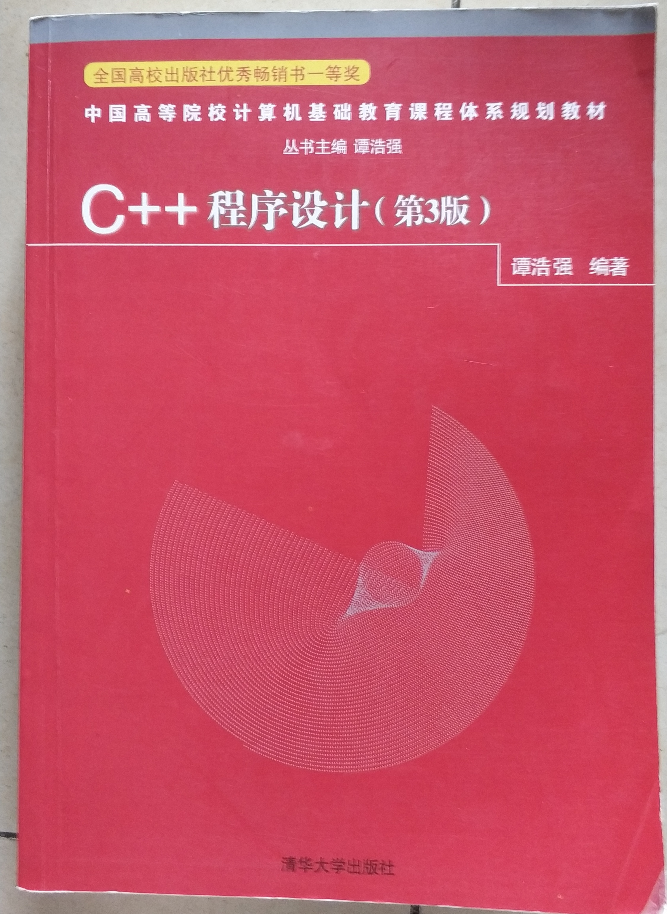

## README.md
    以下二手书均为一口价，不刀🔪

### 1、Visual C++ 面向对象与可视化程序设计
    95成新非正版教材，无笔记划线（只有名字）
    清华大学出版社
##### 原价：￥36.00
##### 一口价：￥7.99

### 2、数据结构（第2版）
    95成新非正版教材，有几条划线
    人民邮电出版社
##### 原价：￥35.00
##### 一口价：￥7.99

### 3、C++程序设计（第3版）
    9成新非正版教材，有几条笔记
    清华大学出版社
##### 原价：￥49.50
##### 一口价：￥11.99

### 4、C Primer Plus（第6版）
    强烈推荐给C入门的朋友！👍👍👍
    9成新正版书，有几道划线和折痕
    人民邮电出版社
##### 原价：￥89.00
##### 一口价：￥20.99

### 5、PHP和MySQL Web开发（第4版）
    推荐给学PHP有一定基础的朋友！👍👍👍
    全新正版书
    机械工业出版社
##### 原价：￥95.00
##### 一口价：￥28.00

### 6、Head First HTML & CSS
    推荐给HTML有一定基础、想走前端的朋友！👍👍
    书的风格非常生动有趣！
    全新正版书
    中国电力出版社
##### 原价：￥98.00
##### 一口价：￥30.00

### 7、Head First JAVA
    推荐给JAVA入门的朋友！👍👍
    书的风格非常生动有趣！
    全新正版书
    中国电力出版社
##### 原价：￥79.00
##### 一口价：￥24.00

### 8、瓦尔登湖
    9成新正版书
    天津人民出版社
##### 原价：￥39.80
##### 一口价：￥9.99

